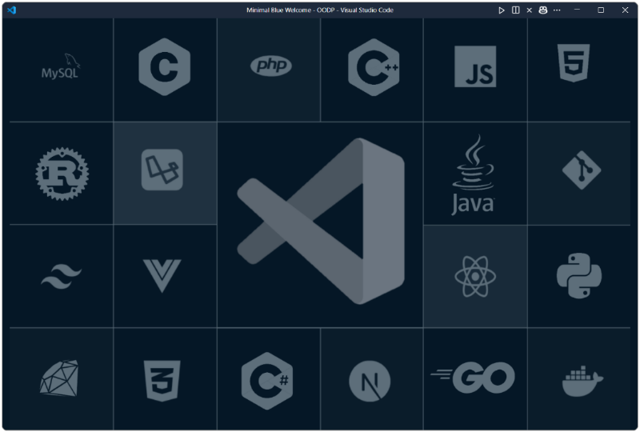
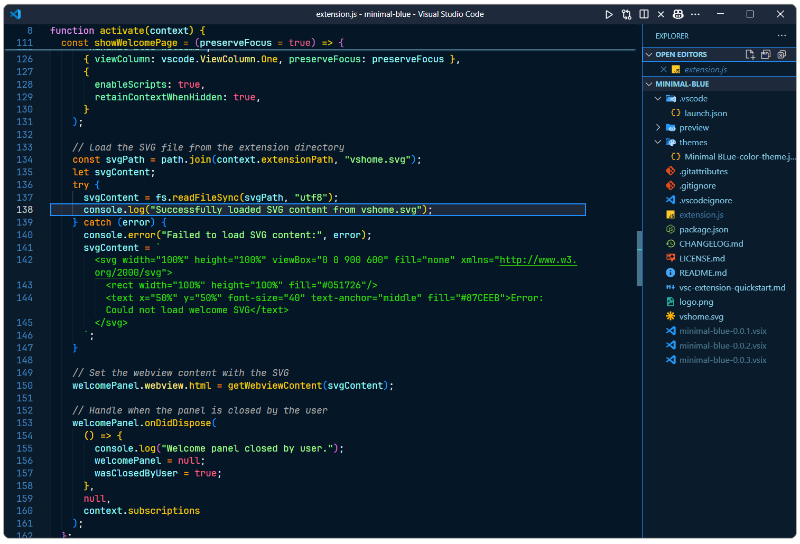
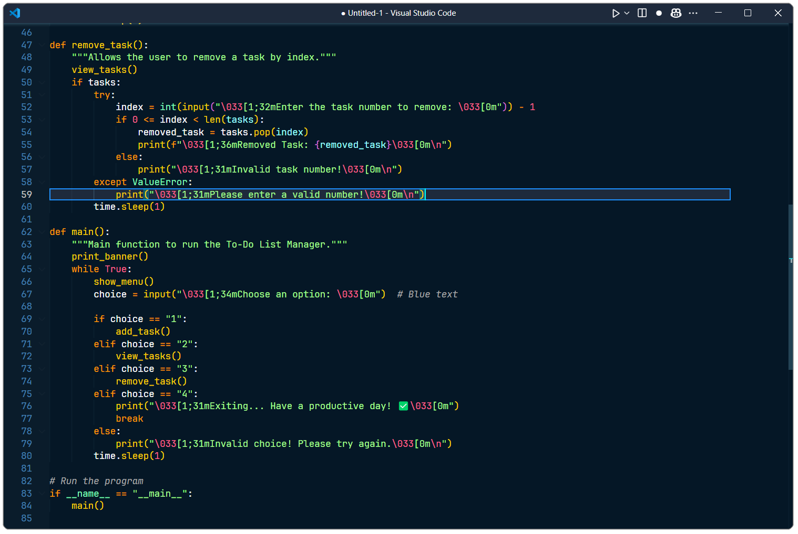
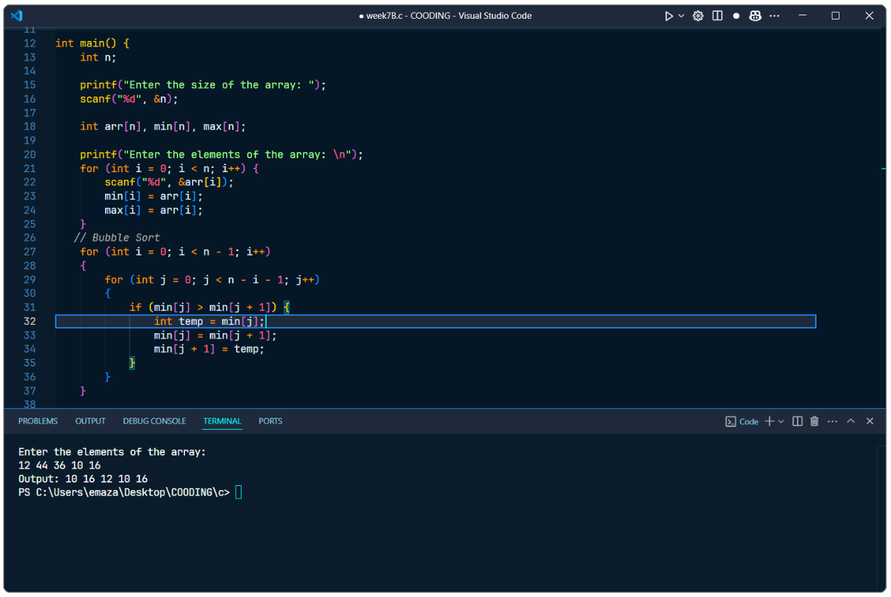

# Minimal Blue 🌌 (Theme + UI)

Minimal Blue is a dark, minimalist theme for Visual Studio Code, designed to provide a **minimal, distraction-free UI** 🔧 as its core USP, with a sleek aesthetic. This theme removes unnecessary UI elements, applies curated settings for a **minimal UI** 🔧, and features a clean line highlight to keep you focused on your code. It also includes a custom welcome page for a personalized touch. ✨

---

## 💻 Interface Preview

### 📷 Screenshots

<p align="center">   </p> <p align="center">
  </p>

- _A detailed view of the interface, including the code preview within the extension._

### 🎥 Live Preview (GIF)


- _Experience the extension in action with its clean, minimal interface._

---

## 🚀 Installation

### **Method 1: Install via VS Code Extensions**

1. Open VS Code.
2. Go to the **Extensions** view:
   - Press `Ctrl+Shift+X` (Windows/Linux) or `Cmd+Shift+X` (macOS).
3. Search for `Minimal Blue` in the search bar.
4. Click **Install**.
5. Set the theme:
   - Open the **Command Palette**:
     - Press `Ctrl+Shift+P` (Windows/Linux) or `Cmd+Shift+P` (macOS).
   - Type and select `Preferences: Color Theme`.
   - Choose **Minimal Blue** from the list.

### **Method 2: Manual Installation via VSIX**

#### **Option 1: Using VS Code UI**

1. Open VS Code.
2. Go to the **Extensions** view:
   - Press `Ctrl+Shift+X` (Windows/Linux) or `Cmd+Shift+X` (macOS).
3. Click the **`...` (menu button)** in the top-right corner of the Extensions view.
4. Select **Install from VSIX...**.
5. Locate and select the `minimal-blue-0.0.3.vsix` file downloaded from the [GitHub Releases page](https://github.com/AzamAliCodes/minimal-blue-vscode-theme/releases/latest).
6. Restart VS Code if necessary.

#### **Option 2: Using the Terminal**

1. Download the `.vsix` file from the [GitHub Releases page](https://github.com/AzamAliCodes/minimal-blue-vscode-theme/releases/latest).
2. Open your terminal.
3. Run the following command: _[ Within command update the version of .vsix file downloaded ]_
   ```sh
   code --install-extension minimal-blue-0.0.3.vsix
   ```
4. Restart VS Code if necessary.

---

## 🌟 Features

- 🖥️ **Minimal, Distraction-Free UI** 🔧: The core USP of Minimal Blue—hides unnecessary UI elements like the Activity Bar, Status Bar, and breadcrumbs for a clean, focused coding environment.
- ✨ **Shiny Line Highlight**: Features a highlight on the current line to keep your focus on the active code.
- 🎨 **Dark Minimal Theme**: A beautiful dark theme with a minimalist color palette.
- 📄 **Custom Welcome Page**: Displays a welcome page (using `vshome.svg`) when no editors are open, enhancing the **minimal UI** 🔧 experience.
- ⚙️ **Recommended Settings**: Automatically applies settings for a **minimal UI** 🔧, now organized into categories and applied only if not already customized.
- 📦 **Extension Recommendations**: Suggests Material Icon Theme and Prettier for a complete setup.

---

## 🛠️ Usage

### 📜 Custom Welcome Page

- The welcome page appears automatically when no editors are open and the "Minimal Blue" theme is active, complementing the **minimal UI** 🔧 design.
- To show it manually:
  - Open the Command Palette (`Ctrl+Shift+P` or `Cmd+Shift+P` on macOS).
  - Run `Minimal Blue: Show Welcome Page`.

### ⚙️ Recommended Settings

The extension applies the following settings on first activation (if not already customized) to achieve a **minimal UI** 🔧. **Technical Update**: Settings are now organized into categories and only applied if the user hasn't customized them, ensuring a non-intrusive experience. 🔧

#### 🎨 Theme and Appearance

- Sets the theme to "Minimal Blue".
- Uses Material Icon Theme for icons.

#### 🖼️ Workbench Layout

- Hides the Activity Bar and Status Bar to support a **minimal UI** 🔧.
- Moves the Sidebar to the right.
- Hides editor tabs, showing only the active file for a cleaner look.
- Hides the default VS Code welcome page and Command Center to reduce clutter.
- Hides the custom title bar for a **distraction-free** look.
- Automatically resizes the centered layout to fit content.
- Toggles the menu bar (shows on Alt key press) for a **minimal UI** 🔧.

#### ✍️ Editor Settings

- Disables minimap character rendering and enables autohide to keep the editor clean.
- Sets Prettier as the default formatter with format-on-save enabled.
- Disables accessibility support for performance.
- Enables word wrap so long lines automatically break to fit the editor width.
- Shiny Line Highlight: Enhances the active line highlight for better focus.

#### 📜 Scrollbar Settings

- Auto-hides horizontal and vertical scrollbars (appears only when scrolling).
- Sets scrollbar thickness to 8 pixels for a comfortable and visible experience.
- Prevents clicking the scrollbar from scrolling a full page.

#### 📁 File and Explorer Settings

- Shows full folder structure in the Explorer.
- Disables delete confirmation prompts and badges to reduce distractions.
- Trims trailing whitespace and ensures final newlines in files.
- Sorts files by type (e.g., `.js` before `.json`) for better organization.

#### 🖋️ Typography Settings

- Sets the editor font to `JetBrains Mono` for a **minimalist** look. _(If not installed, download and install from [JetBrains Mono](https://www.jetbrains.com/lp/mono/).)_
- Disables font ligatures for better readability.
- Configures code suggestion font size to 16 and line height to 30 for better readability.
- Sets the terminal font size to 14 and line height to 1.3 for a comfortable experience.

#### 🔍 Other

- Disables breadcrumbs, Git decorations, and sticky scroll in the File Explorer to maintain a **minimal UI** 🔧.
- Enables word wrapping in the diff and chat editors.

---

## ⌨️ Keyboard Shortcuts

For a minimal experience, many UI elements are hidden to reduce distractions. Keyboard shortcuts allow you to access commands and navigate the interface quickly without relying on visible buttons. Click the arrow below to reveal the complete list of essential keyboard shortcuts:

<details>
  <summary><strong>Click here to view Keyboard Shortcuts</strong></summary>

| Function                           | Windows/Linux  | macOS         |
| ---------------------------------- | -------------- | ------------- |
| Toggle Menu Bar (Reveals Menu Bar) | `Alt`          | `Alt`         |
| Quick Open File                    | `Ctrl+P`       | `Cmd+P`       |
| Open Command Palette               | `Ctrl+Shift+P` | `Cmd+Shift+P` |
| Open Explorer                      | `Ctrl+Shift+E` | `Cmd+Shift+E` |
| Open Extensions View               | `Ctrl+Shift+X` | `Cmd+Shift+X` |
| Search in Workspace                | `Ctrl+Shift+F` | `Cmd+Shift+F` |
| Find in File                       | `Ctrl+F`       | `Cmd+F`       |
| Toggle Sidebar                     | `Ctrl+B`       | `Cmd+B`       |
| Close Active Editor                | `Ctrl+W`       | `Cmd+W`       |
| Close All Editors                  | `Ctrl+K W`     | `Cmd+K W`     |
| Split Editor                       | `Ctrl+\`       | `Cmd+\`       |
| Toggle Terminal                    | `` Ctrl+` ``   | `` Cmd+` ``   |
| Focus Editor Group 1               | `Ctrl+1`       | `Cmd+1`       |
| Focus Editor Group 2               | `Ctrl+2`       | `Cmd+2`       |
| Start Debugging                    | `F5`           | `F5`          |
| Stop Debugging                     | `Shift+F5`     | `Shift+F5`    |

</details>

---

## 📦 Recommended Extensions

- 🖼️ **Material Icon Theme** (`PKief.material-icon-theme`): Enhances file and folder icons.
- ✍️ **Prettier** (`esbenp.prettier-vscode`): Formats code automatically.

---

## 🌐 GitHub Repository

- 📌 GitHub Repository: [AzamAliCodes/minimal-blue-vscode-theme](https://github.com/AzamAliCodes/minimal-blue-vscode-theme)
- 📌 Check out other project on GitHub: [AzamAliCodes](https://github.com/AzamAliCodes)

## ⓘ Extention Link (VS Code Marketplace)

**╰┈➤[Minimal Blue Theme (Releasing Soon)](https://marketplace.visualstudio.com/items?itemName=YourPublisherName.minimal-blue)**

## 🔗 Download (.vsix)

- 📦 [Download the latest release (.vsix)](https://github.com/AzamAliCodes/minimal-blue-vscode-theme/releases/latest)

---

## 📜 License

This extension is licensed under the [MIT License](LICENSE.md). 📄

---
